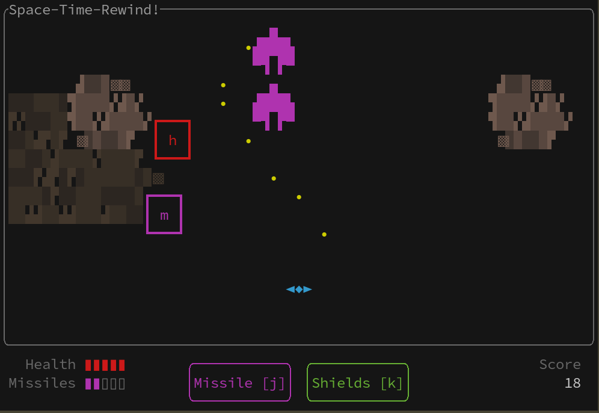

# Space-Time-Rewind! (STR)

An arcade game where you pilot a spaceship on adventures through space and time.



## Game design

Constraints

* text user interface: utf-8 art
* keyboard-only controls
* single player
* simple AI

Objectives

* infinitely replayable or rogue-lite
* expandable over time

## Developing

* [crossterm documentation](https://docs.rs/crossterm/latest/crossterm/)
* [til > rust](https://github.com/andornaut/til/blob/master/docs/rust.md)
* [tui documentation](https://docs.rs/tui/latest/tui/)
* [tui documentation > widgets](https://docs.rs/tui/latest/tui/widgets/index.html)
* [tui > examples > canvas](https://github.com/fdehau/tui-rs/blob/master/examples/canvas.rs)

n.b. Requires Rust from the *nightly* channel as of 1.59.0-nightly to support
[`mixed_integer_ops`](https://doc.rust-lang.org/nightly/unstable-book/library-features/mixed-integer-ops.html#mixed_integer_ops).

```
cargo test
cargo run
cargo build
./target/debug/space_time_rewind
```
